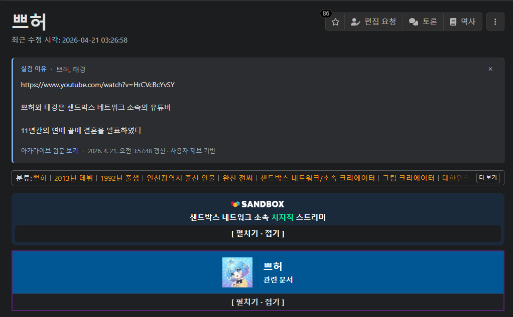

<p align="center">
  
</p>

<h1 align="center">namu-hot-reason</h1>

나무위키 문서 페이지에서 해당 문서가 **실검에 왜 올랐는지**를 [아카라이브 「나무위키 실검 알려주는 채널」](https://arca.live/b/namuhotnow)의 사용자 제보 글을 바탕으로 보여 주는 브라우저 익스텐션.

## 미리보기



## 동기

나무위키 실검은 키워드만 노출될 뿐 왜 그 키워드가 지금 뜨는지 맥락을 보여주지 않습니다. 실검을 눌러 해당 문서로 들어가도 사건·뉴스 직후 위키 본문에 즉시 반영되는 경우는 드물어, 실검의 정보 가치가 반감됩니다. 이 확장은 아카라이브에 실시간으로 올라오는 "왜 뜨는지" 제보 글을 끌어와 문서 페이지 안에 작은 카드로 띄워 그 간극을 메웁니다.

## 기능

- 나무위키 문서 페이지(`https://namu.wiki/w/*`) 진입을 감지해 문서명을 최근 아카 게시글과 매칭.
- 문서 제목 바로 아래, 본문 흐름 안에 본문 폭 꽉 차게 테마 맞춤 카드 렌더.
- 리다이렉트 alias 처리(`?from=빅나티` → `BIG Naughty`) — 원본 검색어를 먼저 시도.
- SPA 내비게이션 대응 — 실검 리스트에서 다른 문서로 이동하면 카드 재렌더.
- 나무위키 라이트/다크 테마 자동 감지 및 색상 매칭.
- 옵션 페이지에서 on/off, 갱신 주기, 카드 위치(문서 상단 / 우측 하단 플로팅) 설정.

## 설치 (개발용 unpacked)

```bash
npm install
npm run build
npm run icons   # PNG 아이콘 생성 (최초 1회 또는 icon.svg 수정 후)
```

1. Chrome 또는 Edge에서 `chrome://extensions` 열기.
2. 우측 상단 **개발자 모드** 켜기.
3. **압축해제된 확장 프로그램 로드** 클릭 → 프로젝트 루트의 `dist/` 폴더 선택.

## 개발

```bash
npm run dev        # HMR 지원 Vite 개발 서버
npm test           # vitest 단위 테스트
npm run typecheck  # tsc --noEmit
npm run build      # 프로덕션 빌드 → dist/
npm run icons      # icon.svg → icons/icon-{16,48,128}.png 재생성
```

### 프로젝트 구조

```
src/
├── manifest.json          MV3 매니페스트
├── background/index.ts    서비스 워커: 아카 fetch·캐시·메시지 핸들링·alarms
├── content/index.ts       content script: 제목 추출·이유 질의·카드 렌더·SPA 내비 감지
├── ui/card.ts             Shadow DOM 카드 (나무위키 테마 자동 매칭)
├── options/               옵션 페이지 (on/off, 주기, 카드 위치)
└── lib/
    ├── arca-parser.ts     아카 HTML 파서 (SW에 DOMParser가 없어 regex 기반)
    ├── matcher.ts         키워드 매칭 (정규화 → 완전일치 → 부분일치 → 제목 fallback)
    ├── namuwiki.ts        URL → 문서명 + ?from= alias 후보
    ├── storage.ts         chrome.storage.local 래퍼
    ├── html-utils.ts      HTML 엔티티 디코드·중첩 태그 균형 파싱
    ├── log.ts             `[namu-hot-reason]` 프리픽스 로거
    └── types.ts           공용 타입
icons/                      생성된 PNG 아이콘 (16, 48, 128)
icon.svg                    아이콘 소스(SVG)
store/                      Chrome Web Store 등록용 설명 텍스트
```

### 디버깅

- **백그라운드**: `chrome://extensions` → 해당 확장의 "서비스 워커" 링크 → DevTools 콘솔에서 fetch·파싱·매칭 로그 확인.
- **content script**: 나무위키 탭에서 DevTools 열고 `[namu-hot-reason]` 프리픽스로 필터링.

## 동작 원리

1. **이유 수집.** 서비스 워커가 주기적으로(기본 10분) `arca.live/b/namuhotnow` 글 목록을 fetch·파싱해 `{keyword, reason, postTitle, sourceUrl}` 엔트리로 `chrome.storage.local`에 저장.
2. **매칭.** 나무위키 문서 페이지가 열리면 content script가 문서명과 `?from=` alias 후보를 백그라운드에 넘기고, 백그라운드가 우선순위 순으로 캐시를 뒤져 첫 매치를 반환.
3. **본문 lazy fetch.** 매치된 엔트리에 본문이 없으면 해당 글 페이지를 한 번 더 fetch해 최대 800자 가량 본문을 추출·저장(다음 매칭부터 재사용).
4. **렌더.** content script가 Shadow DOM으로 카드를 만들고, 문서 `<h1>`의 "가장 넓은 상위 래퍼" 뒤에 삽입 — flex/grid로 좁아진 제목 칼럼을 벗어나 본문 폭을 채웁니다.

## Chrome Web Store 등록

- 스토어 리스팅에 붙일 설명 텍스트는 [`store/listing.md`](./store/listing.md)에 있습니다.
- 필요한 이미지 규격:
  - 아이콘 128×128 — `icons/icon-128.png`
  - 작은 홍보 타일 440×280 (필수)
  - 스크린샷 1280×800 또는 640×400 (1장 이상 필수)

## 한계와 주의사항

- **출처 신뢰도**: 이유 텍스트는 아카라이브 사용자 제보 기반입니다. 카드에는 항상 원문 링크가 함께 노출되며, 사용자 제보임이 명시됩니다.
- **DOM 변경**: 아카라이브나 나무위키의 DOM이 크게 바뀌면 파서 셀렉터나 카드 삽입 대상이 업데이트되어야 할 수 있습니다.
- **Rate limit**: 약 1분 이상 갱신 주기를 권장합니다. 기본값은 10분.
- **인용 범위**: 본문은 짧은 발췌로만 보여 주고, 원문은 링크로 연결합니다.

## Credits

- 이유 데이터: [아카라이브 「나무위키 실검 알려주는 채널」](https://arca.live/b/namuhotnow) 및 기여자들.

## License

[MIT](./LICENSE)
